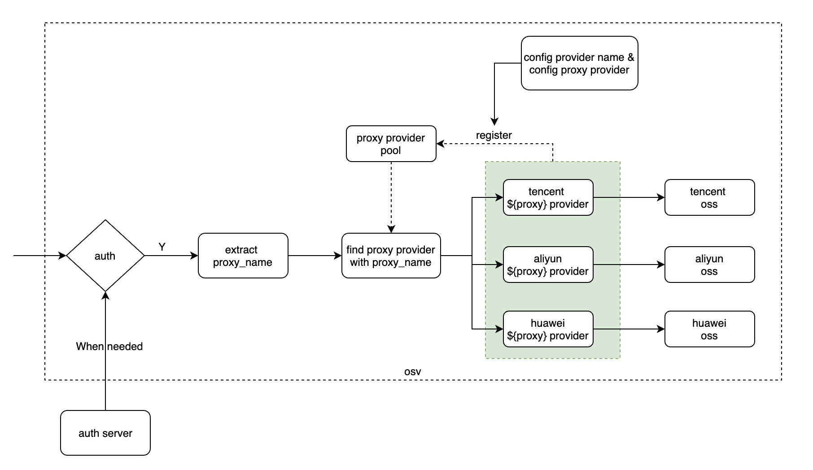

# oss-server

阿里云oss和腾讯云oss的反向代理

## 目的：

1. 简化oss访问的处理
2. 支持oss的上传

## design





## usage

可以在配置中修改，添加支持的provider，然后当前如果只有一个provider，则在url
中可以省略prvoider的提供

如果provider下只有一个name可以使用，则name同样可以省略。


```bash

git clone https://github.com/damonchen/oss-server
cd oss-server/cmd/osv
go build
osv web --cfg config/config.yaml
```

将`config.yaml` 复制到你的服务器，按照配置文件中的说明进行配置

```bash
curl http://localhost:8092/oss/${proxy_name}?path=${xxxx}
```

上面的`${tagtag}`替换为你实际配置中的`name`，` ${xxxx}`替换为你实际在oss上的路径地址。（注意，aliyun上的bucket名称不要放进去）


## current support

- aliyun oss, using provider name: `aliyun`
- tencent oss, using provider name: `tencent`


## TODO

- [ ] huawei

```bash
http://localhost:8092/oss/tagtag/
```
